<div align="center">
  
</div>

<div align="center">

[](https://github.com/NicolasBarrosQA)

</div>

<div align="center">

[](https://linkedin.com/in/nicolas-barros-910852197)
[](mailto:nicolasescaleta@gmail.com)
[](https://github.com/NicolasBarrosQA)
[](#)


</div>


## `01` &nbsp; Quem é Nicolas

**Nicolas Eduardo Barros Silvério** — Hortolândia/SP, disponível para atuação remota.

Trabalho no ponto em que processo industrial e software se encontram: faço engenharia reversa de rotinas críticas sem documentação numa **indústria farmacêutica regulada**, escrevo o backend que as substitui, cubro com **testes automatizados e quality gate**, conecto a **agentes de IA** — e acompanho até o go-live na fábrica.

<div align="center">
  
</div>

**O que isso envolve na prática:**

- 🏭 **Operação crítica** — SAP GUI, SAP MII, EBR e SE-Suite em processos regulados e auditáveis de manufatura farmacêutica.
- 🧩 **Engenharia** — arquitetura modular, máquina de estados, persistência e retomada após falha, logging estruturado e contrato funcional documentado por módulo.
- 🛡️ **Qualidade** — pirâmide completa (unitário, integração, API, E2E) com quality gate que **bloqueia merge**. Todo defeito corrigido vira teste permanente.
- 🤖 **IA aplicada** — LLMs e agentes em fluxo de negócio real, com governança e validação. O primeiro foi um agente de triagem e ranqueamento de currículos, em 2023.
- 🗣️ **Ponto focal** — levantamento, homologação, go-live em unidades fabris, treinamento de líderes e operadores e apresentação de resultados à diretoria.

```python
class NicolasBarros:
    stack     = ["Python", "FastAPI", "C#/.NET", "TypeScript", "Laravel"]
    dominios  = ["Automação & RPA", "Backend & APIs", "IA aplicada", "Qualidade"]
    sistemas  = ["SAP GUI", "SAP MII", "SE-Suite", "EBR", "Copilot Studio"]
    metodo    = "engenharia reversa → modelagem → automação → teste → go-live"
```

<details>
<summary><b>⟢ Como eu trabalho (método em 5 passos)</b></summary>

<br>

| # | Etapa | O que acontece na prática |
|:--|:------|:--------------------------|
| **1** | **Diagnóstico** | Observo o processo rodando, leio logs e telas, e reconstruo a regra que ninguém escreveu. |
| **2** | **Modelagem e validação cruzada** | Escrevo a regra descoberta e valido com cada área envolvida antes de codar uma linha. |
| **3** | **Arquitetura modular** | Um módulo por responsabilidade, contrato funcional documentado, testável isoladamente. |
| **4** | **Blindagem** | Estado persistido, retomada do ponto exato de falha, timeout/retry, log auditável, interface de conferência humana. |
| **5** | **Adoção** | Homologação, go-live, treinamento do operador e suporte em produção até o processo rodar estável. |

</details>


## `02` &nbsp; Impacto

<div align="center">
  
</div>

| Antes | Depois | Como |
|:------|:-------|:-----|
| Processo de dias, dominado por **uma única pessoa** (conhecimento tácito) | **8–10 min por operador** | Motor de 14 transações SAP com máquina de estados e retomada de falha |
| **4 pessoas × 7–9 meses** para reclassificar 6.000+ códigos | **~1 semana**, >1.000 itens/dia | Automação em massa com validação humana e aprovação de comitê de segurança |
| **~40 min** por ciclo de registro de limpeza | **1–3 min**, multiusuário | Integração nativa ao SAP MII resolvendo o grafo de dependências (sem screen scraping) |
| Projeto **parado há 2 meses** + orçamento de **R$ 60 mil** em consultoria | **7 endpoints em produção**, custo zero de consultoria | FastAPI própria com REST, SOAP, JWT e OpenAPI, plugada no Microsoft Copilot Studio |
| Defeito encontrado vira ticket esquecido | Defeito vira **teste permanente** | Quality gate em CI que bloqueia merge diante de qualquer falha |


## `03` &nbsp; O que eu construí

> Soluções em produção e produtos próprios, construídos do zero.

<table>
<tr>
<td width="50%" valign="top">

### ⚙️ Motor de automação de processo SAP
`EMS S.A.` · Python · ~14.500 linhas · 14 módulos

Orquestra **14 transações SAP interdependentes**, cada etapa condicionada ao resultado da anterior. Estado persistido por transação, **retomada do ponto exato da falha**, tratamento de pop-ups, carregamentos e timeouts, modos completo / parcial / retomada.

**Complexidade:** manter consistência de estado numa cadeia longa e frágil — design modular com contrato funcional documentado por transação.

**Impacto:** substituiu processo de dias dominado por conhecimento tácito de uma só pessoa → **8–10 min por operador**.

</td>
<td width="50%" valign="top">

### 🧮 Reclassificação de materiais em massa
`EMS S.A.` · Python · processamento em massa

**6.000+ códigos de produto** e todas as suas versões. Estimativa original: **4 pessoas por 7 a 9 meses**.

Mapeei o comportamento de cada grupo de materiais, construí interface de conferência para validação do operador antes da efetivação e submeti a solução ao **comitê de segurança** — aprovada.

**Impacto:** **>1.000 itens/dia**, etapa bloqueadora reduzida a **~1 semana**.

</td>
</tr>
<tr>
<td width="50%" valign="top">

### 📚 SE-Suite Smart API
`EMS S.A.` · FastAPI · REST + SOAP + JWT + OpenAPI

API que consome o motor de busca do sistema documental corporativo: **busca por palavras-chave com score de relevância**, comparação entre documentos, garantia da versão mais recente e extração de conteúdo de PDF.

Integrada a um agente no **Microsoft Copilot Studio**, transformando os endpoints em ferramentas de consulta assistida por IA.

**Impacto:** **7 endpoints** em produção interna. Dispensou consultoria externa de **R$ 60 mil** e destravou um projeto **parado havia 2 meses**.

</td>
<td width="50%" valign="top">

### 🧹 Logbook de limpeza de recursos
`EMS S.A.` · Python · SAP MII nativo · grafo de dependências

Integração direta ao **SAP MII** que resolve a ordem de execução a partir do **grafo de dependências entre recursos fabris** e efetiva os registros ponta a ponta — **sem screen scraping**.

**Impacto:** ciclo de **~40 min → 1–3 min**, com uso simultâneo por múltiplos usuários.

</td>
</tr>
<tr>
<td width="50%" valign="top">

### 🎓 Plume — SaaS de gestão escolar
`projeto próprio` · Laravel · Inertia · React · TS · PostgreSQL · Docker

Plataforma **multi-tenant** construída do zero como produto completo: backend, frontend, banco, containerização, testes e pipeline de deploy. Módulos de autenticação, organizações, matrículas, gestão acadêmica, financeiro e portal do aluno — várias escolas na mesma base com **isolamento lógico**.

**Qualidade:** **240 testes** (221 unitários/feature + 19 E2E em Playwright), cobrindo segurança, **conformidade LGPD** e regressão. **CI com quality gate que bloqueia merge.**

**Governança:** especificações, ADRs, critérios de aceite e definition of done versionados no repositório.

</td>
<td width="50%" valign="top">

### 🧪 Suíte QA — Desafio Minhas Finanças
`C#/.NET` · xUnit · SQLite · TypeScript · Vitest · Playwright

**Pirâmide de testes completa** para aplicação financeira full-stack. Unitários cobrindo regra de negócio real (restrição de receita para menores, categoria por finalidade, exclusão em cascata), integração com **banco isolado e descartado a cada execução** e E2E nos fluxos críticos.

**Resultado:** **71 testes automatizados**, suíte estável com **59 aprovados e 0 falhas**, e **17 bugs** de regra de negócio e interface documentados com reprodução e evidência — separados dos casos estáveis para manter a regressão confiável.

### 💬 Aza Planner — assistente financeiro com IA
`projeto próprio` · Python · NLP pt-BR · Pix

Finanças pessoais gamificadas com chatbot que **interpreta comando em linguagem natural**, categoriza e registra a transação sozinho. Validado em uso real.

</td>
</tr>
</table>

### 📦 Portfólio open source

| Repositório | O que ele prova |
|:------------|:----------------|
| [**picpay-desafio-backend**](https://github.com/NicolasBarrosQA/picpay-desafio-backend) | Backend Python sério — FastAPI, SQLAlchemy, PostgreSQL, Alembic, Docker, regra de negócio coberta por testes e migrations versionadas |
| [**qa-automation-challenge**](https://github.com/NicolasBarrosQA/qa-automation-challenge) | QA production-minded — E2E e testes de API em Playwright com quality gate no GitHub Actions |
| [**minhas-financas-qa-tests**](https://github.com/NicolasBarrosQA/minhas-financas-qa-tests) | Pirâmide de testes completa com regras de negócio documentadas e evidências |
| [**aza-finance-app**](https://github.com/NicolasBarrosQA/aza-finance-app) | Fullstack moderno — React + TS + Vite, Supabase, CI encadeado, deploy na Netlify |
| [**aetheris-permadeath-record**](https://github.com/NicolasBarrosQA/aetheris-permadeath-record) | Produto fullstack JS construído do zero em HTML5 Canvas |


## `04` &nbsp; Trajetória

<table>
<tr>
<td width="30%" valign="top">

**`mai/2025 — atual`**

### EMS S.A.
`Indústria farmacêutica` · PJ

**Analista de Automação, Soluções Digitais e Qualidade de Software**

</td>
<td width="70%" valign="top">

- Automações em **Python** e APIs em **FastAPI** para processos críticos de manufatura, integrando **SAP GUI, SAP MII e SE-Suite** por REST e SOAP.
- **Engenharia reversa de processos não documentados**, com arquitetura modular orientada a responsabilidades, logging estruturado, persistência de estado e retomada segura após falha de SAP, rede ou interface.
- APIs com **Pydantic, JWT e OpenAPI**, processamento de XML/JSON e integração com agentes de IA e **Microsoft Copilot Studio**.
- Criação e execução de cenários de teste, validação de regra de negócio, evidências, rastreabilidade de defeitos e aceite técnico.
- **Go-lives nas unidades fabris de Manaus e Brasília** — liderança de equipe de projeto, treinamento de líderes e operadores e apresentação de resultados à diretoria.

</td>
</tr>
<tr>
<td width="30%" valign="top">

**`dez/2024 — mai/2025`**

### VeloTracker

**Analista de Suporte Técnico e Validação de Sistemas**

</td>
<td width="70%" valign="top">

- Investigação, reprodução e documentação de falhas com análise de comportamento, logs, dados e cenários de uso.
- Rotinas automatizadas em Python para verificação de processos — **redução de inconsistências recorrentes** e ganho de confiabilidade operacional.
- Mapeamento de jornada de usuário e tradução de necessidade operacional em requisito técnico claro.

</td>
</tr>
<tr>
<td width="30%" valign="top">

**`jan/2023 — jul/2024`**

### ENELO
`Mercado livre de energia`

**Consultor de Soluções**

</td>
<td width="70%" valign="top">

- Atuação consultiva traduzindo demanda de stakeholder em solução operacional e técnica.
- Automações em Python para extração, conferência e tratamento de bases estruturadas, **eliminando retrabalho manual recorrente**.
- **Agente de IA para triagem de currículos**, capaz de analisar e ranquear candidatos por aderência à vaga — **antes da popularização dos agentes baseados em LLM**.

</td>
</tr>
</table>


## `05` &nbsp; Stack

<table>
<tr><td valign="top" width="50%">

**Linguagens**


**Backend & APIs**


**Frontend**


</td><td valign="top" width="50%">

**Qualidade & Testes**


**IA, OCR & Dados**


**Infra & DevOps**


**Sistemas corporativos**


</td></tr>
</table>


## `06` &nbsp; Formação, certificações e idiomas

| Formação / certificação | Detalhe |
|:--|:--|
| 🎓 **Engenharia de Software** | UNASP — Centro Universitário Adventista de São Paulo · cursando, conclusão prevista **dez/2027** |
| 🏭 **Técnico em Automação Industrial** | IFSP — Instituto Federal de São Paulo |
| 🤖 **Trilha Especialista em Inteligência Artificial** | Santander Open Academy + Alura (2026) · **100+ horas** · Python, análise de dados com Pandas, IA generativa, engenharia de prompt, machine learning, automação e bots |
| 🌐 **Inglês — B1 em evolução para B2** | Open Access English School, parceira educacional da **Cambridge University Press** · prática recorrente de conversação |


## `07` &nbsp; GitHub em números

<div align="center">


</div>


## `08` &nbsp; Para onde eu vou

Consolidando a atuação em **backend e engenharia de software ponta a ponta**, com automação e IA aplicada como alavanca, e construindo em direção ao **mercado internacional**.

<div align="center">

**Aberto a conversas sobre backend, automação em escala, plataformas de qualidade e IA aplicada a processo real.**

</div>

<div align="center">
  
</div>

<div align="center">

[](https://linkedin.com/in/nicolas-barros-910852197)
[](mailto:nicolasescaleta@gmail.com)

</div>
